<div style="background: #fff3cd; color: #856404; border-left: 6px solid #ffe083; padding: 14px 18px; border-radius: 6px; margin: 18px 0; display: flex; align-items: center; font-weight: 500;">
    <span style="font-size: 1.3em; margin-right: 0.6em;">&#9888;&#65039;</span>
    <span>
        <strong>Important:</strong> Dự án này hiện đã hoàn tất. Sẽ không có bất kỳ bản cập nhật nào trong tương lai.
    </span>
</div>
<h1 align="center">HỆ THỐNG KHẢO SÁT TRỰC TUYẾN<br/>TRƯỜNG ĐẠI HỌC SAO ĐỎ</h1>

<p align="center">
    <em>Đồ án tốt nghiệp - Xây dựng hệ thống khảo sát trực tuyến sử dụng Laravel Framework.</em>
</p>

<p align="center">
  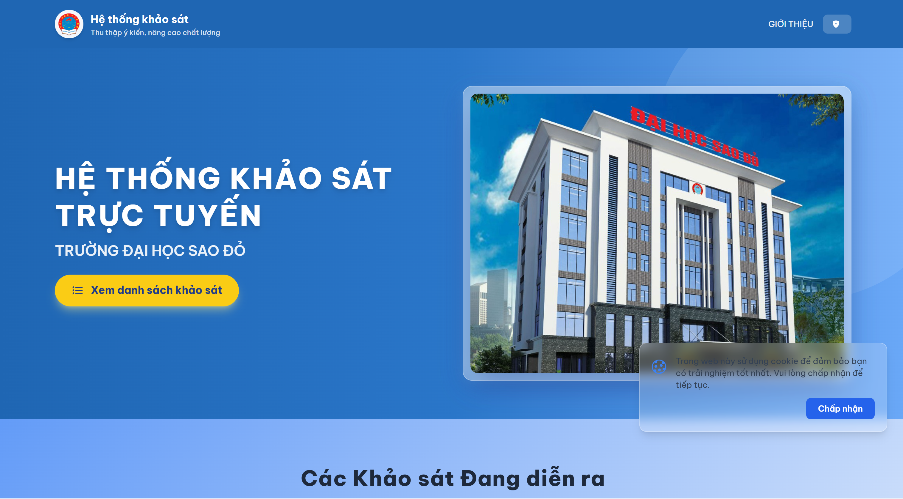
</p>

<p align="center">
  
  
  
  
</p>

---

## Giao diện hệ thống

<details>
<summary><b>1. Màn hình chính</b></summary>
<br>


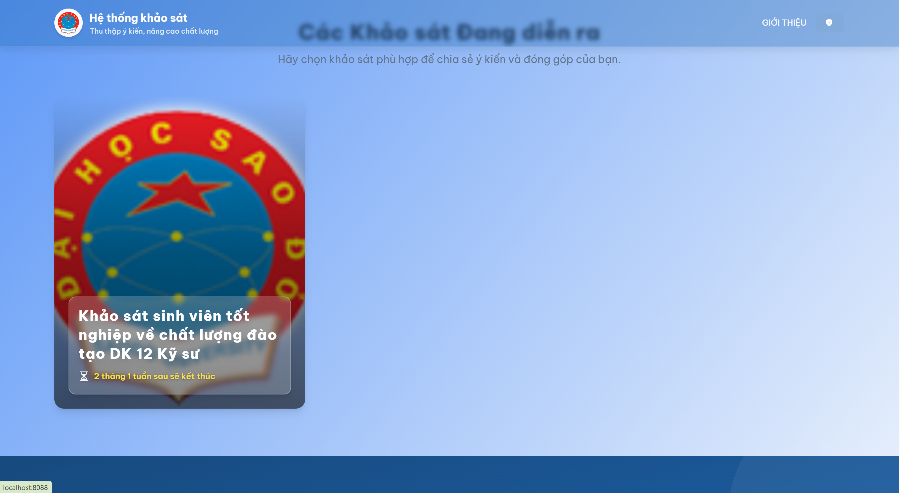
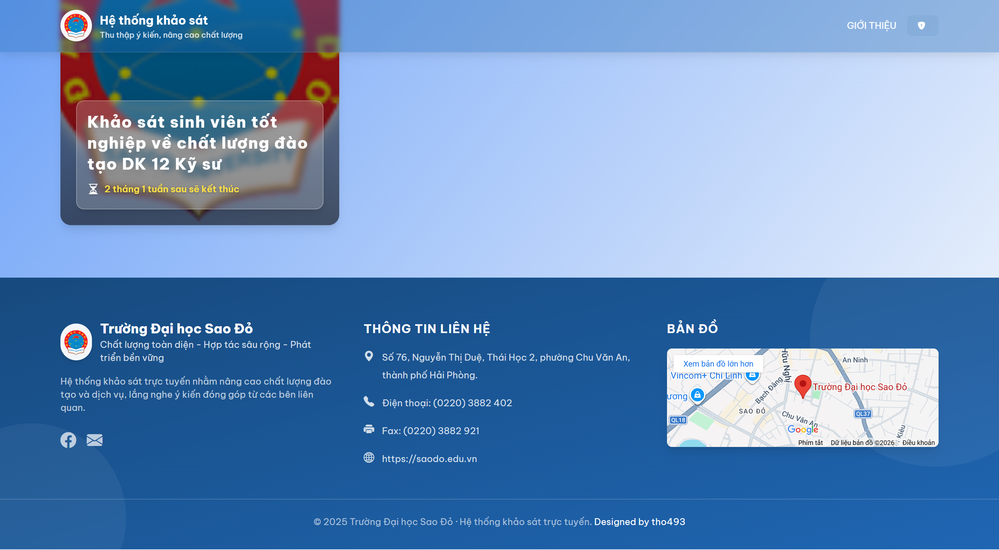

</details>

<details>
<summary><b>2. Giao diện tham gia khảo sát</b></summary>
<br>

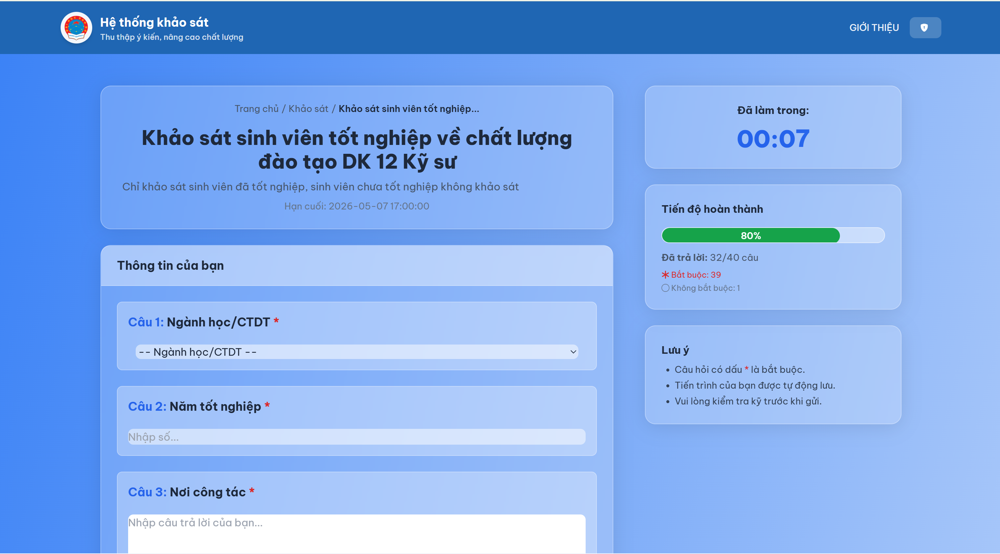
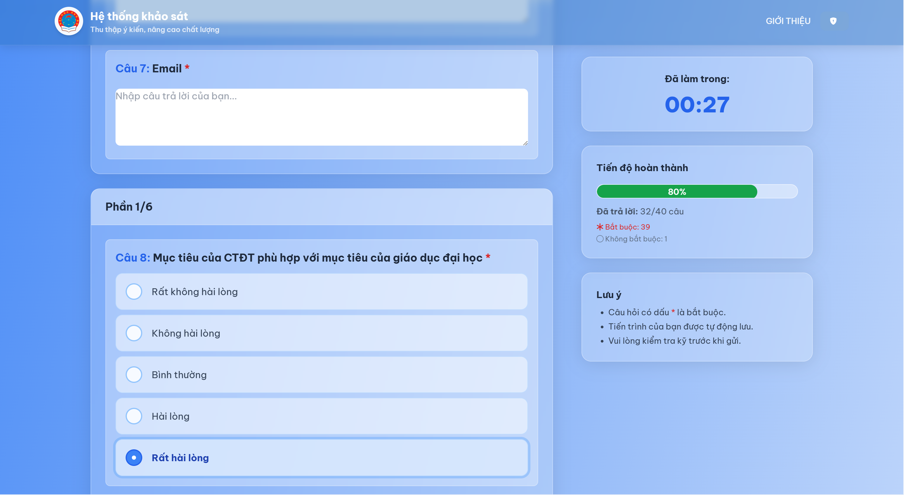
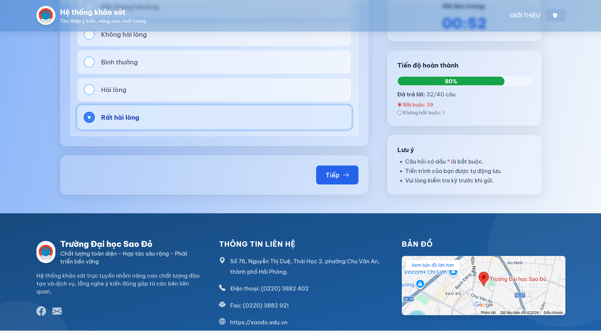

</details>

<details>
<summary><b>3. Trang quản trị (Admin Panel)</b></summary>
<br>

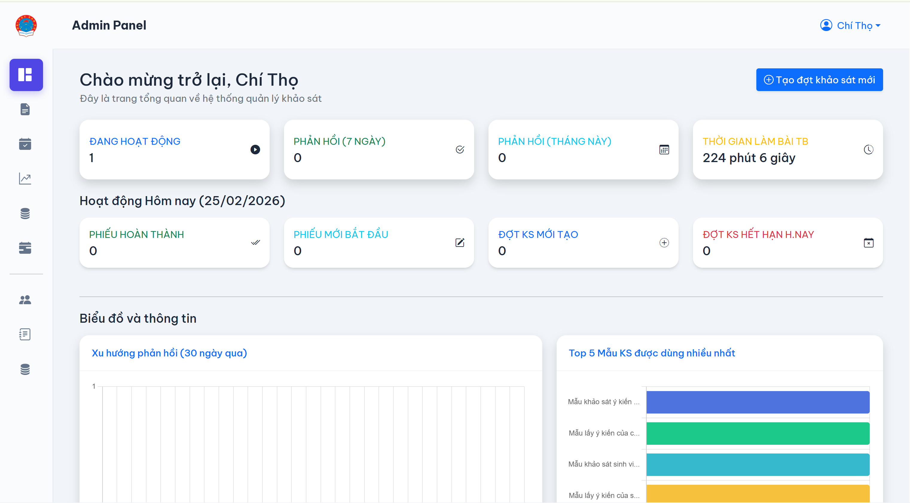
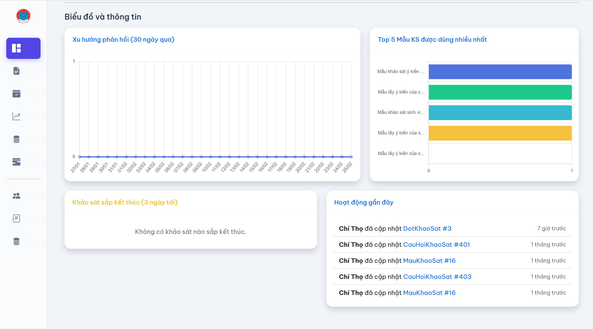
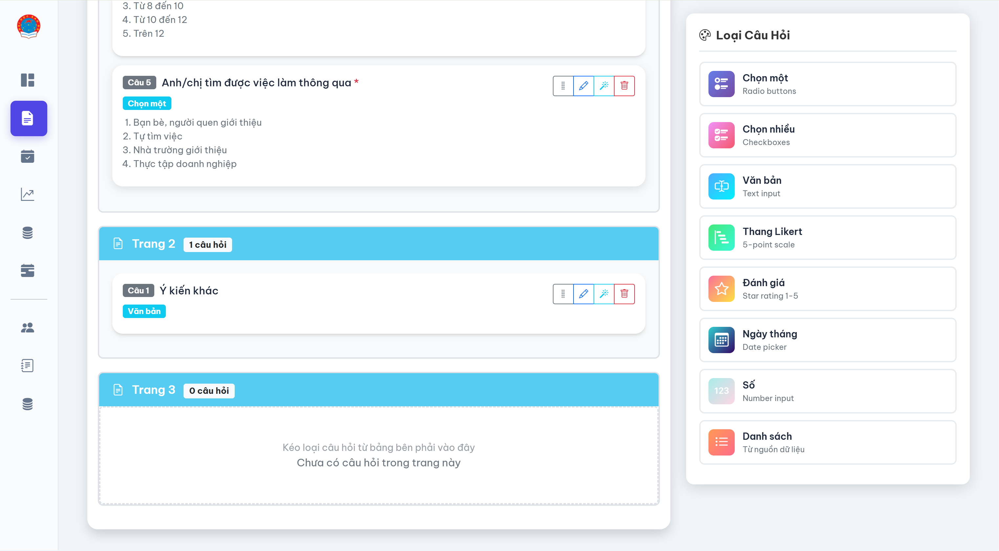
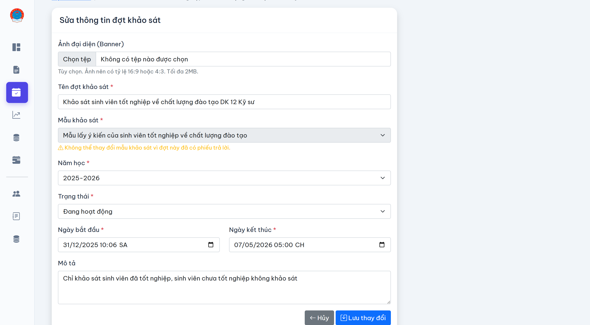
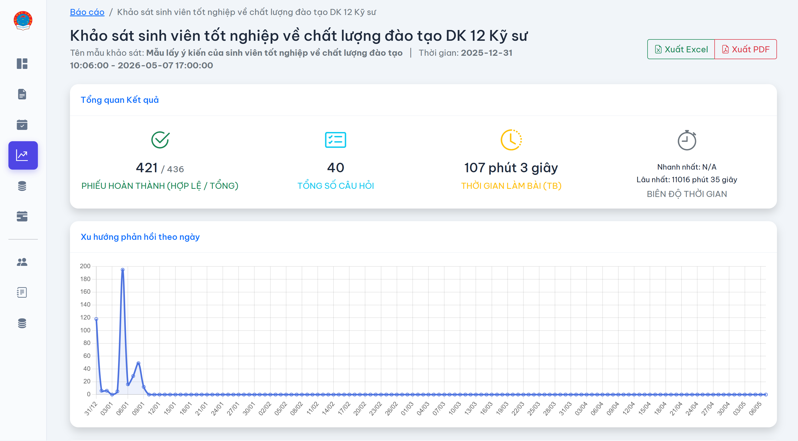
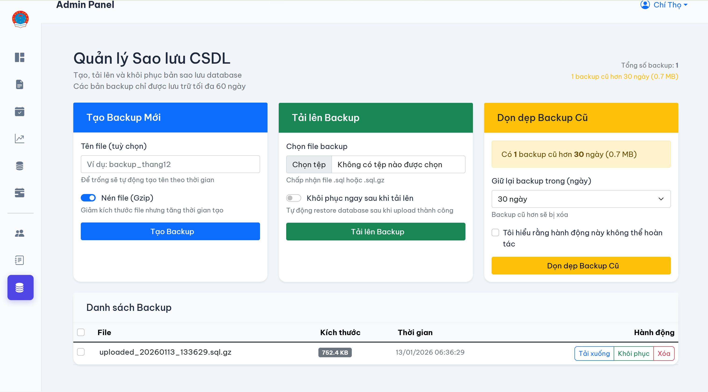
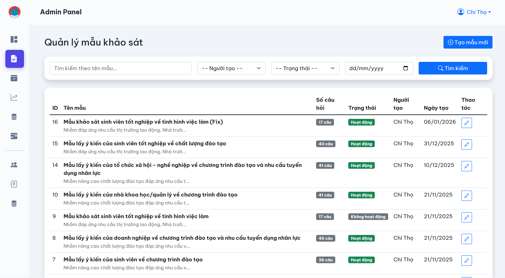

</details>

---

## _Tính năng nổi bật_

- **Quản lý Khảo sát Động:** Dễ dàng tạo, sửa, xóa, và sao chép các mẫu khảo sát.
- **Quản lý Đợt khảo sát:** Lên lịch và quản lý các đợt khảo sát theo thời gian.
- ~~**Xác thực người tham gia:** Hỗ trợ import danh sách (Excel) để giới hạn người được phép làm khảo sát.~~
- **Báo cáo & Thống kê:** Giao diện báo cáo trực quan với biểu đồ, bảng biểu và chức năng xuất file Excel/PDF.
- **Phân tích nâng cao:** Hỗ trợ phân tích chéo (cross-tabulation) để tìm ra mối liên hệ giữa các câu trả lời.
- **Bảo mật:** Tích hợp Google reCAPTCHA v2 để chống spam và bot.
- **Ghi log hoạt động:** Theo dõi mọi thay đổi quan trọng trong hệ thống.

---

## **Hướng dẫn Cài đặt & Triển khai**

Bạn có thể cài đặt hệ thống theo **2 cách**:

- **Cách truyền thống (thủ công) với PHP/Composer**
- **Cách sử dụng Docker (khuyên dùng cho môi trường production hoặc muốn setup nhanh)**

---

### **A. Cài đặt truyền thống (PHP/Composer)**

#### 1. Yêu cầu hệ thống

- **Git**
- **Web Server:** Apache/Nginx (XAMPP, Laragon, WAMP được hỗ trợ)
- **PHP:** `8.1` trở lên
- **Composer:** `2.x` trở lên
- **Database:** MySQL hoặc MariaDB

#### 2. Cấu hình môi trường PHP

Trước khi cài đặt, bạn cần đảm bảo môi trường PHP đã được cấu hình đúng.

1.  **Tìm file `php.ini`:**
    Mở Terminal (hoặc Command Prompt) và chạy lệnh:

    ```sh
    php --ini
    ```

    Lệnh này sẽ hiển thị đường dẫn đến file `php.ini` đang được sử dụng (ví dụ: `C:\xampp\php\php.ini`).

2.  **Kích hoạt các extension cần thiết:**
    Mở file `php.ini` và tìm các dòng sau, sau đó **xóa dấu chấm phẩy (`;`)** ở đầu mỗi dòng để kích hoạt chúng:

    ```ini
    ;extension=curl
    ;extension=fileinfo
    ;extension=gd
    ;extension=intl
    ;extension=mbstring
    ;extension=openssl
    ;extension=pdo_mysql
    ```

    Sau khi sửa, chúng sẽ trở thành:

    ```ini
    extension=curl
    extension=fileinfo
    extension=gd
    extension=intl
    extension=mbstring
    extension=openssl
    extension=pdo_mysql
    ```

3.  **(Quan trọng) Cấu hình chứng chỉ SSL (cacert):**
    Để khắc phục lỗi `cURL error 60: SSL certificate problem`, bạn cần chỉ cho PHP biết nơi lưu trữ file chứng chỉ gốc.
    - Tải file `cacert.pem` mới nhất từ trang chính thức của cURL: [https://curl.se/docs/caextract.html](https://curl.se/docs/caextract.html)
    - Lưu file này vào một vị trí cố định, ví dụ: `C:\xampp\php\extras\ssl\cacert.pem` (tự tạo thư mục `extras\ssl` nếu chưa có).
    - Trong file `php.ini`, tìm và sửa 2 dòng sau (bỏ dấu `;` và thêm đường dẫn):
        ```ini
        curl.cainfo = "C:\xampp\php\extras\ssl\cacert.pem"
        openssl.cafile= "C:\xampp\php\extras\ssl\cacert.pem"
        ```

4.  **Khởi động lại Web Server:**
    Sau khi lưu file `php.ini`, hãy **khởi động lại Apache** trong XAMPP/Laragon/WAMP để áp dụng các thay đổi.

#### 3. Cài đặt Project

1.  **Clone repository:**

    ```sh
    git clone https://github.com/tho493/khao_sat.git he-thong-khao-sat
    cd he-thong-khao-sat
    ```

2.  **Cài đặt các thư viện (dependencies):**

    ```sh
    composer install
    ```

3.  **Tạo file môi trường `.env`:**
    Sao chép file `.env.example` thành `.env`, sau đó tạo khóa ứng dụng.

    ```sh
    copy .env.example .env
    php artisan key:generate
    ```

4.  **Cấu hình Database:**
    Mở file `.env` và chỉnh sửa các thông tin kết nối database cho phù hợp:

    ```env
    DB_CONNECTION=mysql
    DB_HOST=127.0.0.1
    DB_PORT=3306
    DB_DATABASE=khao_sat_db
    DB_USERNAME=root
    DB_PASSWORD=
    ```

5.  **Import & Seed Database:**
    - Tạo một database rỗng với tên bạn đã khai báo trong `.env` (ví dụ: `khao_sat_db`).
    - Import file [`khao_sat_db.sql`](./database/khao_sat_db.sql) được cung cấp vào database vừa tạo.
    - Chạy seeder để tạo tài khoản admin mặc định (option):

        ```sh
        php artisan db:seed --class=DatabaseSeeder
        ```

        - Tài khoản mặc định: `tho493` / `tho493`

#### 4. Cấu hình Google reCAPTCHA (Bắt buộc)

Hệ thống sử dụng Google reCAPTCHA v2 để bảo mật.

1.  **Đăng ký website:**
    - Truy cập [Google reCAPTCHA Admin Console](https://www.google.com/recaptcha/admin).
    - Đăng ký một site mới với các thông tin sau:
        - **Label:** Tên dự án (VD: Hệ thống Khảo Sát SDU)
        - **reCAPTCHA type:** Chọn **"Challenge (v2)"** -> **"I'm not a robot" Checkbox**.
        - **Domains:** Thêm `localhost` và `127.0.0.1` (để phát triển) và tên miền thật khi deploy.
2.  **Lấy khóa:**
    Sau khi đăng ký, bạn sẽ nhận được **Site Key** và **Secret Key**.
3.  **Cập nhật file `.env`:**
    Mở file `.env` và thêm 2 khóa này vào:
    ```env
    RECAPTCHA_SITE_KEY=YOUR_SITE_KEY_HERE
    RECAPTCHA_SECRET_KEY=YOUR_SECRET_KEY_HERE
    ```

#### 5. Cấu hình Google AI (Chatbot)

1.  **Đăng ký website:**
    - Truy cập [Google AI Studio](https://aistudio.google.com/apikey).
    - Nhấn nút `Get API key` và làm theo hướng dẫn để lấy key api.
2.  **Cập nhật file `.env`:**
    Mở file `.env` và thêm khóa này vào:
    ```env
    GEMINI_API_KEY="YOUR_GEMINI_API_KEY_HERE"
    ```

#### 6. Khởi chạy ứng dụng

1.  **Dọn dẹp cache và link storage (quan trọng):**
    ```sh
    php artisan migrate
    php artisan optimize:clear
    php artisan storage:link
    ```
2.  **Khởi chạy server phát triển:**
    ```sh
    php artisan serve
    ```
3.  **Chạy lệnh cập nhật trạng thái đợt khảo sát:** (Quan trọng, nó giúp bạn tự động cập nhật trạng thái dựa theo giờ bắt đầu của khảo sát)

    ```sh
    php artisan schedule:work
    ```

    - Nếu bạn muốn chạy server trên môi trường production, hãy thay `serve` bằng `serve --port=80`.

4.  **Truy cập vào địa chỉ được cung cấp (thường là `http://127.0.0.1:8000`).**

---

### 🚩 **B. Cài đặt bằng Docker (Nhanh & Đơn giản)**

#### 1. Yêu cầu hệ thống

- **Docker** và **Docker Compose** (tải tại [https://docs.docker.com/get-docker/](https://docs.docker.com/get-docker/))
- Tối thiểu 4GB RAM, 10GB dung lượng trống

#### 2. Cách cài đặt

Bạn có thể cài đặt theo 2 cách:

- **Cách 1: Build từ source**
    - Xem hướng dẫn chi tiết trong file `DOCKER_README.md` đi kèm repo để biết cách clone, build, cấu hình môi trường, khởi tạo database và chạy ứng dụng.
    - Một số lệnh phổ biến:
        - `docker-compose up -d --build` — Khởi động và build containers
        - `docker-compose exec app php artisan migrate` — Chạy migrations
        - `docker-compose logs -f` — Xem logs real-time
        - `docker-compose down` — Dừng toàn bộ dịch vụ

- **Cách 2: Sử dụng image có sẵn**
    - Bạn có thể pull image đã build sẵn từ Docker Hub:
        ```sh
        docker pull tho493/khao-sat:latest
        ```
    - Copy file [`.env.docker.example`](.env.docker.example) thành `.env` và chỉnh sửa lại `GEMINI_API_KEY`, `RECAPTCHA_SITE_KEY`, `RECAPTCHA_SECRET_KEY`, `APP_URL` .

    - Sau đó khởi chạy các image cần thiết:

        ```sh
        docker compose up -d
        ```

    > **Lưu ý:** Bạn cần chỉnh sửa file `.env` (hoặc `env.docker.example`) trước khi chạy lần đầu để cấu hình các API key và thông tin kết nối database. Bạn hãy đổi port 8080 và 8081 sang port khác nếu bạn đã có dịch vụ chạy trên port 8080 hoặc 8081.

#### 3. Tham khảo thêm

- Để biết chi tiết về backup, restore, production, SSL, monitoring... hãy đọc file [`DOCKER_README.md`](./DOCKER_README.md) trong repo.

> **Lưu ý:** Nếu gặp lỗi 500 khi truy cập ứng dụng, hãy thử khởi động lại MySQL và chạy lệnh `php artisan optimize:clear` trong để xóa cache Laravel.

## Thông tin liên hệ

- **Sinh viên thực hiện:** Nguyễn Chí Thọ
- **Email:** [chitho040903@gmail.com](mailto:chitho040903@gmail.com)
- **Facebook:** [@tho493](https://facebook.com/tho493)

---

## Notes

- **Giáo viên hướng dẫn:** ThS. Phạm Văn Kiên
- Phần mềm là sản phẩm thử nghiệm.
